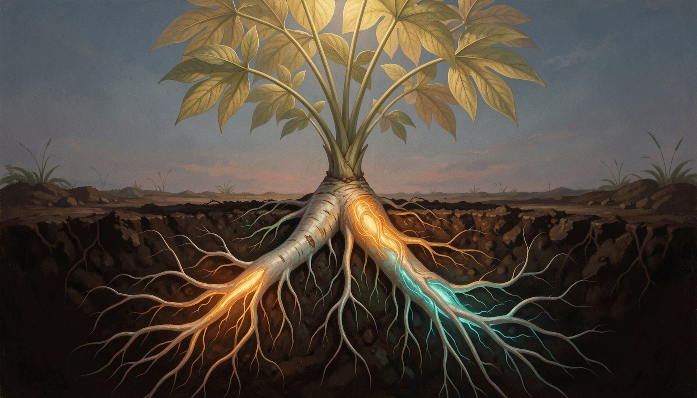

# When Cassava Rewired Itself: A Gene Edit That Paid Off Twice

In crop engineering, there is a stubborn rule: push one trait, and another gives way. Boost nutrition, lose yield. So when scientists used CRISPR to knock out a starch gene in cassava, they expected a trade-off. Instead, the plant solved the problem on its own.

Cassava is a survival crop. Over [800 million people](https://doi.org/10.1016/j.carbpol.2026.125382) — most in sub-Saharan Africa — depend on its starchy roots as a daily calorie source. For some of the world's most food-insecure populations, cassava is not optional; it is the difference between eating and not. Yet cassava's starch is dominated by the rapidly digestible kind, which spikes blood sugar and offers little in the way of dietary fiber. Improving its nutritional profile has long been a goal, but cassava is notoriously genetically recalcitrant — difficult to transform and even harder to edit. It has not been a willing subject for the genome-editing revolution that has already reshaped maize, rice, and wheat.

That is what makes the new study, [published in *Carbohydrate Polymers*](https://doi.org/10.1016/j.carbpol.2026.125382), so striking. Researchers used CRISPR/Cas9 to knock out *MeSSI*, a gene encoding soluble starch synthase I — an enzyme central to building amylopectin, the branched, easily digested component of starch. The logic was straightforward: disable the enzyme that makes "fast" starch, and the plant should shift toward amylose, the linear, harder-to-digest form. That shift is what produces resistant starch, which behaves functionally like dietary fiber — slowing glucose release, feeding beneficial gut bacteria, and improving glycemic response.

The results exceeded expectations. The edited cassava lines showed a **6.7-fold increase in resistant starch content** and a **16.4% rise in amylose levels** compared to unmodified plants. Those numbers alone would be notable. But the real surprise was what did *not* happen: total starch accumulation stayed the same, and storage root yield was unaffected. No penalty. No drag.

Think of it as knocking out a load-bearing wall in a house, only to discover the structure redistributes the weight through pathways you never mapped. That, essentially, is what happened inside the cassava's cells. When researchers removed *MeSSI*, the plant responded by ramping up a different enzyme — *MeSBEI*, a starch branching enzyme. This second enzyme appears to have stepped in to rebalance the system, keeping total starch output stable even as the starch itself became nutritionally superior. The compensation was not engineered. It emerged on its own — a hidden layer of metabolic flexibility that surfaced only when the original gene was removed, an outcome nobody had designed.

This matters beyond cassava. It suggests that genome editing in so-called orphan crops — neglected by decades of breeding investment — may not just replicate what worked in major cereals. It may reveal biology that was always there, waiting to be uncovered. For the hundreds of millions who rely on cassava, the stakes are concrete: a variety that delivers more resistant starch without sacrificing productivity would be a rare nutritional win-win. Farmers would not be asked to choose between feeding their families and nourishing them. Yet getting such a crop into farmers' hands is itself a challenge. Regulatory pathways for gene-edited crops remain fragmented across African jurisdictions — some countries have no clear framework — and even where rules exist, adoption depends on trust, seed systems, and extension infrastructure. The broader difficulty is already evident in [West African efforts to deploy CBSD-resistant cassava varieties from Uganda](https://allianceforscience.org/blog/2023/02/adopt-ugandas-cbsd-resistant-cassava-to-halt-spread-of-the-disease-in-your-region-scientists-tell-west-africans/), where getting improved genetics into farmers' fields has proven as complex as the science itself. The technical breakthrough is necessary but not sufficient.

Important caveats remain. These results come from controlled greenhouse conditions; field trials under real agronomic stress have not yet been reported. The metabolic compensation mechanism is described but not fully mapped — we know *MeSBEI* upregulation occurs, but the precise regulatory cascade is unresolved. And cassava is rarely eaten raw: traditional processing methods like boiling, fermentation, and drying can alter resistant starch levels, meaning the 6.7-fold increase measured in the lab may not translate directly to the dinner plate.

None of these open questions diminish the finding. They define the road ahead: field trials to confirm the trait holds under real growing conditions, processing studies to test whether resistant starch survives boiling and fermentation, and regulatory engagement to ensure the science reaches the farmers who need it most. The cassava rewired itself — now the task is wiring it into the world.